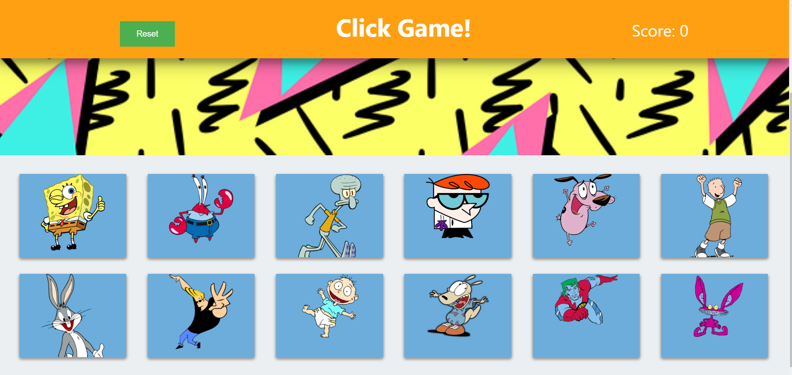

# Cartoon Click Game

## About
This app was built in React and uses some ES6 features for the logic. A simple game, yet demonstrates how easily a React web application can be coded up!

## To Play
This cartoon click game has 12 classic characters (mostly from 90's cartoon shows) on display. Try and click each character only once to score 12 points to win-- careful though, they'll jump around into a different order when you click them!

## Tech Used
* React w/ state
* CSS
* JavaScript

## Todos
- Shake the container or alert the user upon a wrong guess
- Add more themes than just the current characters
- Fix some of the wonky header styles
- Make the card divs the thing to click, not just the images